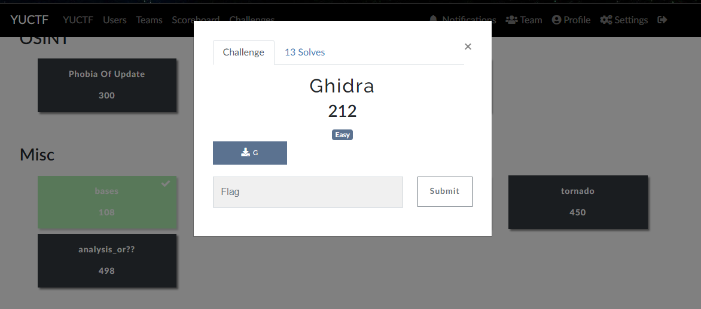
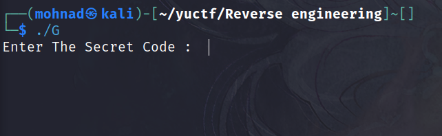
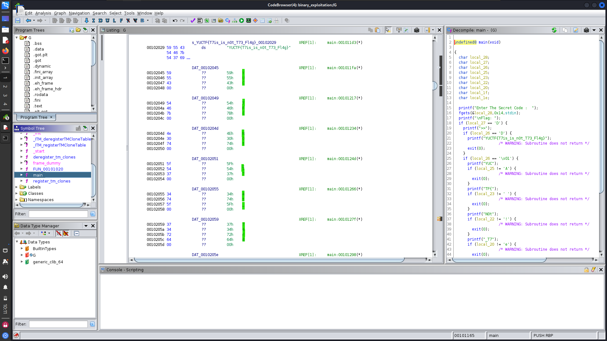

# **Ghidra**

after executing the binary askme for Secret

so open the binary with Ghidra and find 2 flag 
first flag not real flag `YUCTF{T7is_is_n0t_T73_Fl4g}`
second is real flag 

flag :
`YUCTF{N0t_T74t_74rd}`
