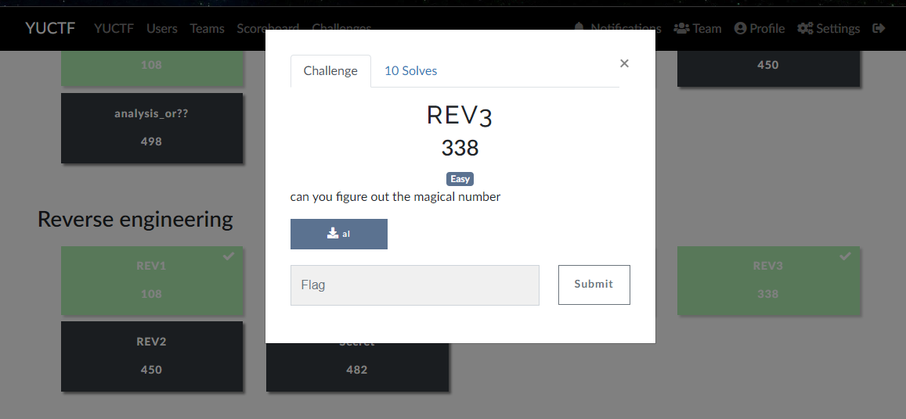
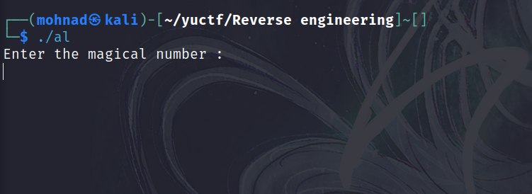
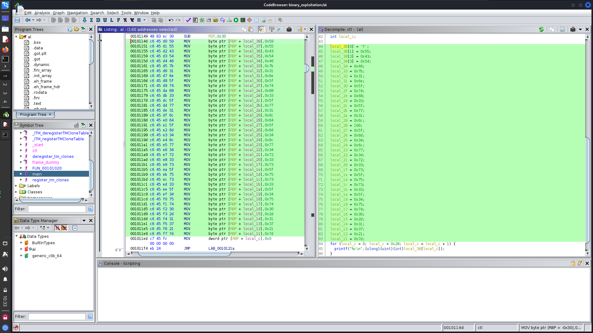

# **REV3**



after executing binary, askme for magic number



so open [ghidra](https://ghidra-sre.org/) and find the magic number 

go to main and i find flaghex LOL 



```
        0010114d c6 45 d0 59     MOV        byte ptr [RBP + local_38],0x59
        00101151 c6 45 d1 55     MOV        byte ptr [RBP + local_37],0x55
        00101155 c6 45 d2 43     MOV        byte ptr [RBP + local_36],0x43
        00101159 c6 45 d3 54     MOV        byte ptr [RBP + local_35],0x54
        0010115d c6 45 d4 46     MOV        byte ptr [RBP + local_34],0x46
        00101161 c6 45 d5 7b     MOV        byte ptr [RBP + local_33],0x7b
        00101165 c6 45 d6 31     MOV        byte ptr [RBP + local_32],0x31
        00101169 c6 45 d7 6e     MOV        byte ptr [RBP + local_31],0x6e
        0010116d c6 45 d8 5f     MOV        byte ptr [RBP + local_30],0x5f
        00101171 c6 45 d9 74     MOV        byte ptr [RBP + local_2f],0x74
        00101175 c6 45 da 68     MOV        byte ptr [RBP + local_2e],0x68
        00101179 c6 45 db 33     MOV        byte ptr [RBP + local_2d],0x33
        0010117d c6 45 dc 5f     MOV        byte ptr [RBP + local_2c],0x5f
        00101181 c6 45 dd 77     MOV        byte ptr [RBP + local_2b],0x77
        00101185 c6 45 de 31     MOV        byte ptr [RBP + local_2a],0x31
        00101189 c6 45 df 6c     MOV        byte ptr [RBP + local_29],0x6c
        0010118d c6 45 e0 64     MOV        byte ptr [RBP + local_28],0x64
        00101191 c6 45 e1 5f     MOV        byte ptr [RBP + local_27],0x5f
        00101195 c6 45 e2 6d     MOV        byte ptr [RBP + local_26],0x6d
        00101199 c6 45 e3 34     MOV        byte ptr [RBP + local_25],0x34
        0010119d c6 45 e4 6c     MOV        byte ptr [RBP + local_24],0x6c
        001011a1 c6 45 e5 77     MOV        byte ptr [RBP + local_23],0x77
        001011a5 c6 45 e6 34     MOV        byte ptr [RBP + local_22],0x34
        001011a9 c6 45 e7 72     MOV        byte ptr [RBP + local_21],0x72
        001011ad c6 45 e8 33     MOV        byte ptr [RBP + local_20],0x33
        001011b1 c6 45 e9 73     MOV        byte ptr [RBP + local_1f],0x73
        001011b5 c6 45 ea 5f     MOV        byte ptr [RBP + local_1e],0x5f
        001011b9 c6 45 eb 75     MOV        byte ptr [RBP + local_1d],0x75
        001011bd c6 45 ec 73     MOV        byte ptr [RBP + local_1c],0x73
        001011c1 c6 45 ed 33     MOV        byte ptr [RBP + local_1b],0x33
        001011c5 c6 45 ee 5f     MOV        byte ptr [RBP + local_1a],0x5f
        001011c9 c6 45 ef 34     MOV        byte ptr [RBP + local_19],0x34
        001011cd c6 45 f0 75     MOV        byte ptr [RBP + local_18],0x75
        001011d1 c6 45 f1 74     MOV        byte ptr [RBP + local_17],0x74
        001011d5 c6 45 f2 30     MOV        byte ptr [RBP + local_16],0x30
        001011d9 c6 45 f3 2d     MOV        byte ptr [RBP + local_15],0x2d
        001011dd c6 45 f4 31     MOV        byte ptr [RBP + local_14],0x31
        001011e1 c6 45 f5 37     MOV        byte ptr [RBP + local_13],0x37
        001011e5 c6 45 f6 21     MOV        byte ptr [RBP + local_12],0x21
        001011e9 c6 45 f7 7d     MOV        byte ptr [RBP + local_11],0x7d
```

flag : 
`YUCTF{1n_th3_w1ld_m4lw4r3s_us3_4ut0-17!}`