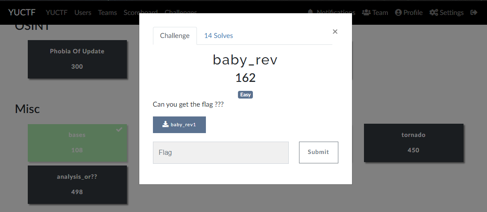
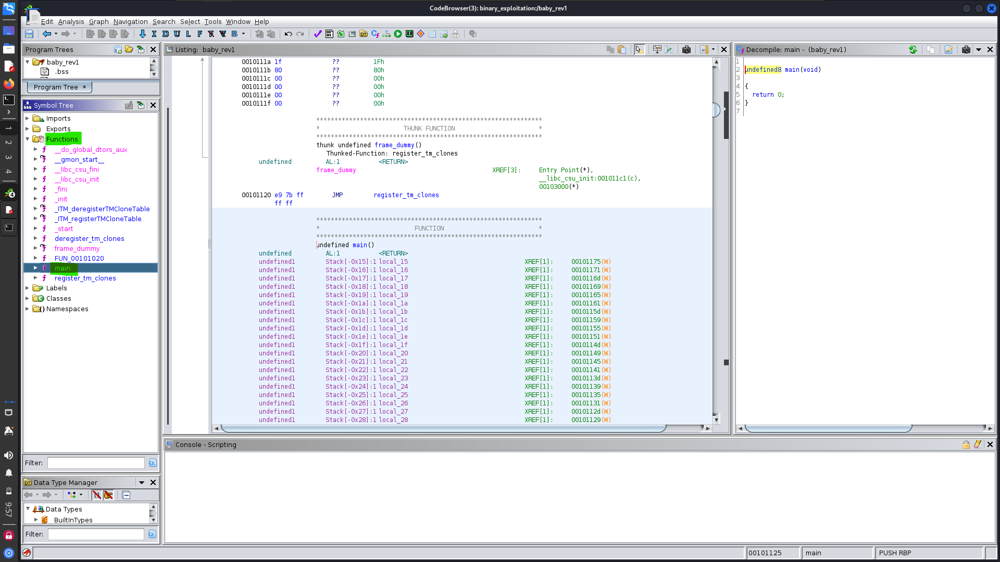
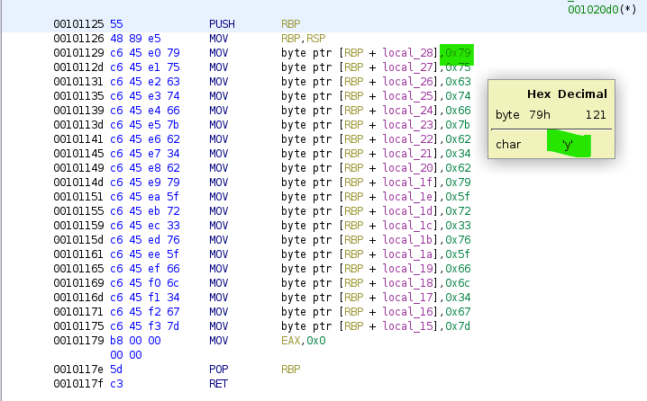

# **baby_rev**



after executing the binary we have nothing
so i well use [Ghidra](https://ghidra-sre.org/) to analyze the binary and find the flag




from `function` go to `main` after scroldown find the flag hex like this:




```
        00101129 c6 45 e0 79     MOV        byte ptr [RBP + local_28],0x79
        0010112d c6 45 e1 75     MOV        byte ptr [RBP + local_27],0x75
        00101131 c6 45 e2 63     MOV        byte ptr [RBP + local_26],0x63
        00101135 c6 45 e3 74     MOV        byte ptr [RBP + local_25],0x74
        00101139 c6 45 e4 66     MOV        byte ptr [RBP + local_24],0x66
        0010113d c6 45 e5 7b     MOV        byte ptr [RBP + local_23],0x7b
        00101141 c6 45 e6 62     MOV        byte ptr [RBP + local_22],0x62
        00101145 c6 45 e7 34     MOV        byte ptr [RBP + local_21],0x34
        00101149 c6 45 e8 62     MOV        byte ptr [RBP + local_20],0x62
        0010114d c6 45 e9 79     MOV        byte ptr [RBP + local_1f],0x79
        00101151 c6 45 ea 5f     MOV        byte ptr [RBP + local_1e],0x5f
        00101155 c6 45 eb 72     MOV        byte ptr [RBP + local_1d],0x72
        00101159 c6 45 ec 33     MOV        byte ptr [RBP + local_1c],0x33
        0010115d c6 45 ed 76     MOV        byte ptr [RBP + local_1b],0x76
        00101161 c6 45 ee 5f     MOV        byte ptr [RBP + local_1a],0x5f
        00101165 c6 45 ef 66     MOV        byte ptr [RBP + local_19],0x66
        00101169 c6 45 f0 6c     MOV        byte ptr [RBP + local_18],0x6c
        0010116d c6 45 f1 34     MOV        byte ptr [RBP + local_17],0x34
        00101171 c6 45 f2 67     MOV        byte ptr [RBP + local_16],0x67
        00101175 c6 45 f3 7d     MOV        byte ptr [RBP + local_15],0x7d

```

flaghex : 79756374667b623462795f7233765f666c34677d

use [CyberChef](https://gchq.github.io/CyberChef/#recipe=From_Hex('Line%20feed')&input=Nzk3NTYzNzQ2NjdiNjIzNDYyNzk1ZjcyMzM3NjVmNjY2YzM0Njc3ZA)


flag :
`yuctf{b4by_r3v_fl4g}`

