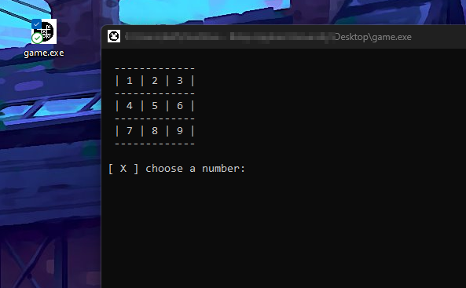

# XO GAME use C++
install 
```powershell
 curl "https://raw.githubusercontent.com/mohnad-0b/programming/main/simple%20game/XO_game.cpp" -O XO_Game.cpp
```
You can choose the icon you want but now :
```powershell 
curl "https://github.com/mohnad-0b/programming/blob/main/simple%20game/XOgame.ico" -O XOgame.ico      
```
Now create a file called `my.rc` or whatever name you want **but ends with .rc** Type in it `id ICON` and the path to your icon
```powershell
 echo "id ICON XOgame.ico" > my.rc
```
and 
```powershell
windres my.rc -O coff -o my.res
```

now compile 
```powershell
g++ -o game  .\XO_game.cpp my.res
```

*enjoy*


